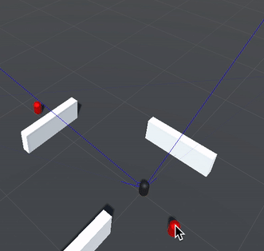

# Opdracht-3_SM-programming_JvdG
Programmeren opdracht 3: Intro to agents and agent-tools - individueel

Zie het word document `Programmeren opdracht 3.docx` voor antwoord op alle vragen.

Hieronder is de simulatie en de werking te zien, de agens (zwarte pion) ziet of er een enemie (rode pion) in zijn zochtveld staat, dit word geuit met eem magneta lijn die getrokken is vanaf de agent naar de enemie.

